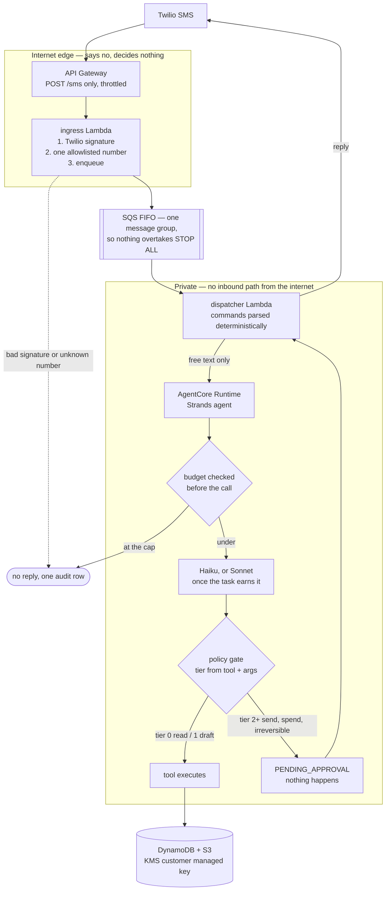
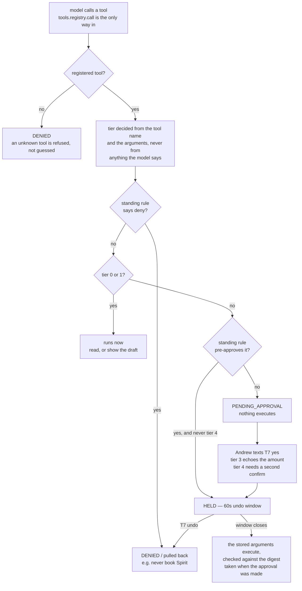
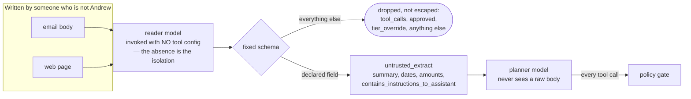

# Errand

[](https://github.com/drewc611/Personal-ai-mobile-assistant-/actions/workflows/ci.yml)
[](https://github.com/drewc611/Personal-ai-mobile-assistant-/actions/workflows/codeql.yml)
[](https://github.com/drewc611/Personal-ai-mobile-assistant-/actions/workflows/security.yml)
[](errand/tests)
[](errand/tests/injection)
[](pyproject.toml)
[](errand/infra)
[](https://github.com/astral-sh/ruff)
[](.github/workflows)

Andrew's personal text agent. Runs in his own AWS account on Bedrock. One user,
one phone number, no work data.

v0 is built: SMS in and out over Twilio, Gmail and Google Calendar read and
draft with gated send, web search, task threads, approvals, standing rules,
batched daily approvals, a 60-second undo window, voice memos, a monthly budget
cap, an audit log, and a disconnect that deletes and issues a receipt.

`errand/CLAUDE.md` has the hard rules and a table of where each one is
enforced. `errand/PLAN.md` has the phases. Read both before changing anything.

## What it wins on

Instinct is the reference point. Each of these answers a reported failure of it
rather than adding a feature it lacks.

| Failure | What Errand does | Where |
|---|---|---|
| Sent email without approval | The tier is decided in `policy/gate.py` and enforced in `tools/registry.py`. The model never holds a reference to a tool implementation. | `policy/`, `tools/registry.py` |
| Kept data after disconnect | `disconnect gmail` revokes the token, deletes every row tagged with that connection, writes a receipt, and texts the counts. | `tools/connections.py` |
| Prompt injection succeeded | Untrusted bytes only ever reach a model invoked with no tool configuration, whose output is forced through a fixed schema. | `reader/` |
| One crowded thread | Every job gets an id. `T7 status`. | `store/tasks_store.py` |
| No model choice | Haiku by default, Sonnet when the task earns it, both from config. | `agent/router.py` |
| No spending control | A monthly cap that warns at 80% and refuses at 100%, checked before each call. | `policy/budget.py` |

## How a text moves through it



The ingress Lambda is the only thing reachable from the internet, and it is a
couple of hundred lines that are entirely about saying no. It cannot read a
task, an approval, or any cached content, so compromising the webhook does not
read the mailbox.

An approved action does not go out immediately. It lands in an outbox with a
release time; a scheduled Lambda sends whatever is past its window. That minute
is the undo.

## How a tool call is decided

This is the disagreement with Instinct, drawn out. The tier comes from the tool
name and its arguments — never from anything the model says about its own
intent. A model that writes "this is only a draft" still gets tier 2 when it
calls `gmail_send`.



## Why an injected email does not get anywhere



Three layers, in order of how much they are trusted: no tools, then the schema,
then the gate. Only the first and third are load-bearing — which is why
`errand/tests/injection/` runs its 26 payloads against a planner that does
exactly what the attacker asked, and asserts nothing left the system anyway.

## Texting it

| Send | What happens |
|---|---|
| anything else | starts a task, replies with a task id |
| a voice memo | transcribed, shown back as `Heard: "..."`, then treated as typed |
| `T7 yes` | approves T7; it goes out in 60 seconds |
| `T7 yes $42.50` | approves a charge, amount echoed back and checked against the cap |
| `T7 no` / `T7 edit` | drops it; edit also asks what to change |
| `T7 status` | one task, with what it is waiting on and its receipts |
| `T7 undo` / `undo` | pulls it back if the window is still open |
| `pending` | the numbered list that `yes 1,3` indexes into |
| `yes all` / `yes 1,3` | batch approval. Skips tier 4 and anything with a charge |
| `tasks` | what's open |
| `rules` | standing rules |
| `tighten dining` | drops the allow rules for a type; deny rules stay |
| `budget` | this month's spend and which models are routed where |
| `disconnect gmail` | revokes, deletes, texts a receipt with counts |
| `STOP ALL` | halts everything and says what it stopped |

Slash forms (`/tasks`, `/budget`) work too. `T7 yes but change the subject` is
not an approval: the arguments Andrew approved are not the arguments he just
described, so it starts a new task.

## One channel interface, not one channel

Everything user-facing goes through `channels/`. A `Button` carries both a tap
token and the text to send instead, so SMS renders `Reply "T7 yes"` while a
channel with real buttons renders a button, from the same code above it.
WhatsApp is a Twilio number prefix and a second construction; v2 voice is a new
file in `channels/`. If any of that needs changes to the agent, the gate, or
the conversation handler, the interface was drawn in the wrong place.

## Running the tests

```bash
python3.12 -m venv .venv
.venv/bin/pip install -r requirements-dev.txt
.venv/bin/python -m pytest errand/tests
```

228 tests, no AWS credentials and no Twilio account needed. The ones worth
knowing about:

- `errand/tests/injection/` runs 26 hostile payloads against a planner that
  does exactly what the attacker asked, and asserts nothing left the system.
  It runs on every push rather than nightly: a prompt edit that makes the
  planner more compliant should fail the build.
- `errand/tests/acceptance/test_v0.py` is the acceptance criteria from
  PLAN.md, one test each, webhook to reply.

## Deploying

```bash
cd errand && make check          # lint, terraform fmt/validate, tests
make build                       # -> build/errand.zip, must stay under 50MB
cd infra
cp terraform.tfvars.example terraform.tfvars   # fill it in
terraform init && terraform apply
```

The Lambda zip carries `requirements-lambda.txt` (boto3 and the `errand`
package) and not `requirements.txt`. Strands and the AgentCore SDK are the
agent container's dependencies; the Lambdas never load a model, and bundling
them put the zip over Lambda's 50MB direct-upload limit. `make build` fails
if the artifact grows past it.

Then, in this order:

1. **Secrets.** Terraform creates the secret containers and never the values,
   because Terraform state is a file on disk.
   ```bash
   # Read interactively so the token never lands in shell history, an agent
   # transcript, or the process list. `read -rs` does not echo; the value
   # reaches the CLI through a file that only you can read and is then shredded.
   umask 077
   read -rsp "Twilio account SID: " SID; echo
   read -rsp "Twilio auth token:  " TOKEN; echo
   jq -nc --arg s "$SID" --arg t "$TOKEN" '{account_sid:$s,auth_token:$t}' > twilio.json
   unset SID TOKEN
   aws secretsmanager put-secret-value --secret-id errand/twilio \
     --secret-string file://twilio.json
   shred -u twilio.json 2>/dev/null || rm -f twilio.json
   ```
   Pasting the token straight into `--secret-string` puts it in `~/.bash_history`
   and, if an AI coding agent is driving the terminal, in its context window and
   transcript. See `SECURITY.md` for the hook that blocks that class of mistake.
2. **Webhook.** Set `terraform output -raw webhook_url` as the messaging
   webhook on the Twilio number. The URL is also configured on the Lambda,
   because signature validation needs the exact string Twilio called and
   rebuilding it from the event gives the internal host.
3. **Connect Google** through AgentCore Identity and set
   `ERRAND_IDENTITY_PROVIDER` on the dispatcher and the runtime.
4. **Model ids and prices.** Look the Haiku 4.5 and Sonnet 5 ids up in the
   Bedrock console for this account and region, and take the rates from the
   Bedrock pricing page. There are no defaults in the code and none in
   Terraform: CLAUDE.md forbids hardcoding a model id, and a stale one would be
   a silent downgrade rather than an error.

Real texting is blocked until US A2P 10DLC registration completes.

Three settings refuse to act while zero, deliberately rather than as
placeholders: `monthly_budget_usd` (every model call refused),
`tier3_cap_cents` (every purchase refused), and `model_rates_json` (the budget
cannot price a call, so calls are refused). `terraform output
configuration_warnings` lists whichever are still unset.

## Repository and CI

Every push runs three workflows, and each one fails the build rather than
warning:

| Workflow | What it refuses to let through |
|---|---|
| `ci` | lint, unit tests, the injection suite, the acceptance criteria, `terraform fmt` and `validate`, and a Lambda artifact that is over 50MB or contains tests, terraform state or the agent's dependencies |
| `codeql` | Python security queries (`security-extended`), also weekly so a new rule finds an old bug |
| `security` | a secret anywhere in the full git history, a dependency with a high-severity advisory, a workflow missing a `permissions:` block, an action pinned to a tag instead of a SHA |

The last two of those are checks on the repository itself. Every action is
pinned to a commit SHA rather than a tag — a tag is a moving pointer its owner
can repoint, a SHA is the code that was reviewed — and CI fails if anyone
reintroduces a tag pin. Dependabot raises weekly PRs to move the pins.

`SECURITY.md` has the full picture, including a section on what is *not*
defended, which is the more useful half.

Everything CI runs is runnable locally:

```bash
cd errand && make check     # lint, terraform fmt + validate, all tests
make build                  # the artifact, with the size guard
```

## Layout

```
errand/
  CLAUDE.md    the hard rules, and what is easy to break
  PLAN.md      the phases
  infra/       terraform: api gateway, lambdas, sqs, dynamodb, s3, kms, secrets, scheduler
  ingress/     Twilio webhook lambda
  agent/       Strands agent, model router, planner prompt, AgentCore entrypoint
  reader/      quarantined reader and schemas
  policy/      tiers, the gate, approvals, standing rules, undo outbox, budget
  tools/       calendar, gmail, search, tasks, rules, disconnect
  channels/    the Channel interface, twilio
  voice/       v2 only
  tests/       unit, injection, acceptance
  common/      config, clock, ids, money, secrets
  store/       the DynamoDB access layer
  dispatcher/  command parsing, conversation handling, voice memos
```

## Open items for Andrew

1. Monthly budget cap in dollars.
2. Per task spend cap for tier 3.
3. SMS registration type. Sole Proprietor applies only with no EIN; with one
   (an LLC, for instance) it has to be Low Volume Standard or Standard. Sole
   Proprietor costs $4 once for the brand, $15 once for campaign vetting, and
   $2 a month, and the brand must be verified from a real mobile carrier
   number, not a VoIP line (Twilio, n.d.; Twilio, 2026).
4. Payment method for v1 purchases: stored card per site, or a virtual card
   with merchant limits.
5. Whether v0 gets WhatsApp as a second channel.

## References

Amazon Web Services. (2025). *Announcing Amazon Nova Sonic, a new speech to speech model that brings real time voice conversations to Amazon Bedrock.* https://aws.amazon.com/about-aws/whats-new/2025/04/amazon-nova-sonic-speech-to-speech-conversations-bedrock/

Amazon Web Services. (n.d.). *Amazon Bedrock AgentCore documentation.* https://docs.aws.amazon.com/bedrock-agentcore/

Amazon Web Services. (n.d.). *Bedrock AgentCore starter toolkit* [Computer software]. GitHub. https://github.com/aws/bedrock-agentcore-starter-toolkit

Amazon Web Services. (n.d.). *Sample Amazon Nova Sonic Twilio integration* [Computer software]. GitHub. https://github.com/aws-samples/sample-amazon-nova-sonic-twilio-integration

AWS Labs. (n.d.). *AWS Bedrock AgentCore MCP server.* https://awslabs.github.io/mcp/servers/amazon-bedrock-agentcore-mcp-server

Carly. (2026). *What is Instinct AI? What early users actually found.* https://www.usecarly.com/blog/what-is-instinct-ai/

MLQ News. (2026). *Instinct is still invite only as its AI assistant takes broad access to users' data.* https://mlq.ai/news/instinct-is-still-invite-only-as-its-ai-assistant-takes-broad-access-to-users-data/

Strands Agents. (n.d.). *Python quickstart.* https://strandsagents.com/docs/user-guide/quickstart/python/

Strands Agents. (n.d.). *Python deployment to Amazon Bedrock AgentCore Runtime.* https://strandsagents.com/docs/user-guide/deploy/deploy_to_bedrock_agentcore/python/

Twilio. (2026). *A2P 10DLC: Gather the required business information.* https://www.twilio.com/docs/messaging/compliance/a2p-10dlc/collect-business-info

Twilio. (n.d.). *A2P 10DLC Sole Proprietor brands FAQ.* https://support.twilio.com/hc/en-us/articles/9550596959643-A2P-10DLC-Sole-Proprietor-Brands-FAQ

Vellum. (2026). *Official Instinct breakdown.* https://www.vellum.ai/blog/official-instinct-breakdown
